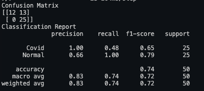
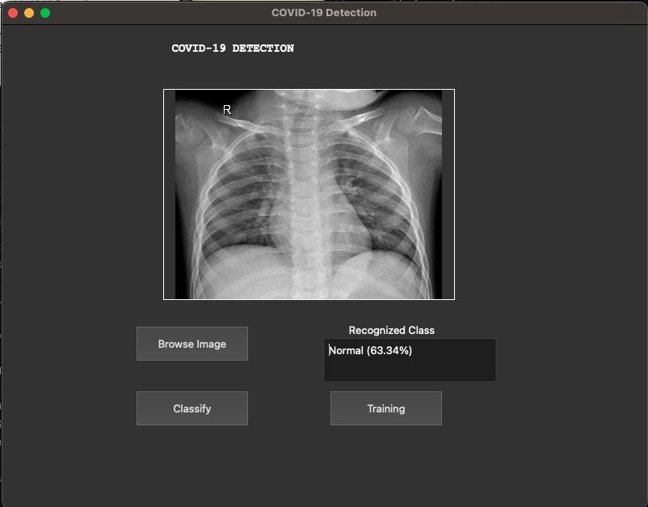
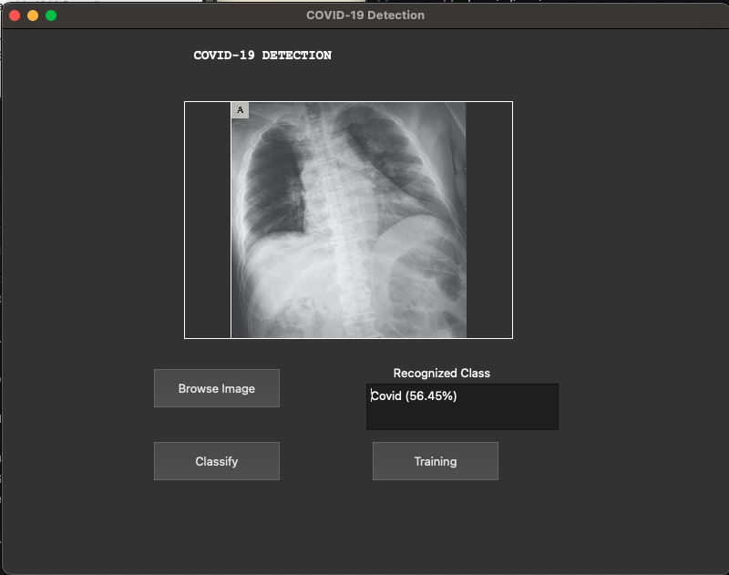

# 🦠 COVID-19 Detection using CNN and PyQt5

A deep learning-based desktop application for detecting **COVID-19 infection from chest X-ray images** using **Convolutional Neural Networks (CNN)**.  
The application is built using **Python**, **TensorFlow/Keras**, and **PyQt5** for an intuitive and interactive GUI.

---

## 🚀 Features

- 🧠 **Train a CNN model** on chest X-ray datasets directly from the GUI.
- 📁 **Load and display images** using an interactive file browser.
- 🔍 **Classify X-ray images** as _COVID_ or _Non-COVID_.
- 📊 **Automatic evaluation** with confusion matrix & classification report.
- 💾 **Save and reload model** (`.json` + `.h5`) for reuse.
- ⚖️ **Handles class imbalance** using computed class weights.
- 🧩 **Early stopping** to prevent overfitting.

---

## 🧠 Model Architecture

The CNN model consists of:

- **Conv2D + MaxPooling2D + BatchNormalization layers** for feature extraction
- **Dropout layers** for regularization
- **Flatten + Dense layers** for classification
- **Output layer:** Softmax activation for 2-class output

**Optimizer:** Adam  
**Loss:** Categorical Crossentropy  
**Metrics:** Accuracy

---

## ⚙️ Requirements

Install all dependencies using:

```bash
pip install tensorflow numpy scikit-learn pyqt5
pip install tensorflow-gpu
```

🖥️ How to Run
1️⃣ Clone the Repository

```bash

git clone https://github.com/<your-username>/COVID-19-Detection-GUI.git
cd COVID-19-Detection-GUI
```

2️⃣ Prepare Dataset
Organize your dataset as shown below:

```bash
TrainingDataset/
 ├── COVID/
 └── Non-COVID/

TestingDataset/
 ├── COVID/
 └── Non-COVID/
```

Each folder should contain relevant chest X-ray images (.jpg, .png, .jpeg).

3️⃣ Run the Application

```bash
python main.py
```

## Results & Screenshots

## 🖼️ Results & Screenshots

<p align="center">
  <br>
  <em>Confusion Matrix</em>
</p>

<p align="center">
  <br>
  <em>Normal Classification Result</em>
</p>

<p align="center">
  <br>
  <em>COVID Classification Result</em>
</p>
